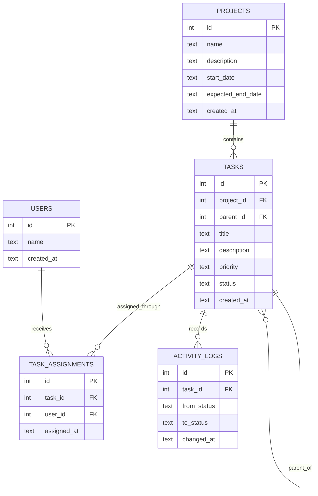

# Entity Relationship Diagram

This ERD covers the official entities for the course project. Assignment, Kanban status, activity log, and reports are prepared in the data model for part 2.

## Relationships

- One project has many tasks.
- A task may have one parent task. `parent_id` is null for a main task.
- Priority is stored on the task as `high`, `medium`, or `low`.
- Status is stored on the task as `new`, `in_progress`, or `done` for the Kanban board in part 2.
- A task can be assigned to many users through `task_assignments`.
- Status changes are stored in `activity_logs` with a timestamp.
